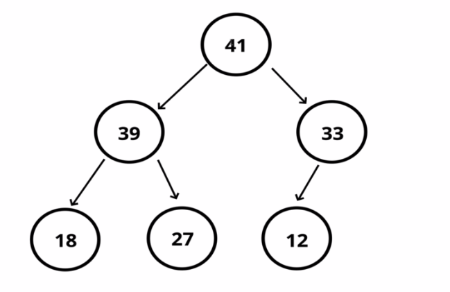
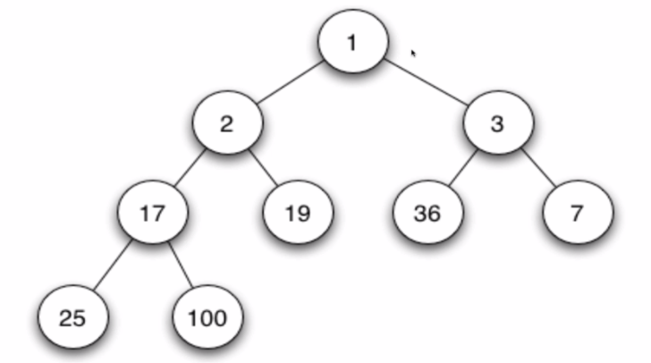
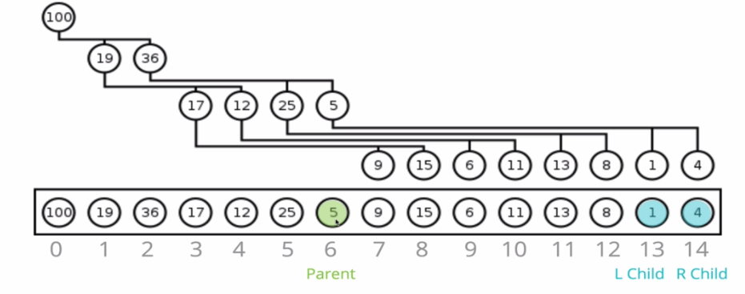

# Binary Heaps
Very similar to a binary tree but with some different rules.  
In a **MaxBinaryHeap**, parent nodes are always larger than child nodes.  
In **MinBinaryHeaps**, parent nodes are always smaller than the children.  
Each node can have a maximum of 2 children.

Here is a MaxBinaryHeap



All nodes are smaller than the parents (mandatory to the max binary heaps).  
The opposite is true for a MinBinaryHeap.

Here is a MinBinaryHeap  


Binary heaps are used to implement priority queues which are very commonly used data structures.  
They are also used to implement graph traversal algorithms.

## Representing heaps
### Using Arrays/Lists
For any index of an array n, the left child is stored at ```2n + 1``` and the right child is stored at ```2n + 2```

This is as shown in the diagram below


5, which is at index 6, has its left child at ```2 * 6 + 1 = 13``` and its right child at ```2 * 6 + 2 = 14```

If we have a child node and want to find its parent, given its index, the parent is at ```(n - 1) / 2```, we floor the result of the operation.

#### Defining our class
We will implement a MaxBinaryHeap, but a MinBinaryHeap is very similar:

```python
from typing import List
class MaxBinaryHeap:
    """max binary heap"""
    def __init__(self):
        self.values: List[any] = []
```

#### Inserting
We add the value to the end of the list and then bubble the value up to where it is supposed to be.  
We keep finding the parent in the heap and swap them if need to until the new value is at the correct position.

##### Inserting Pseudocode
1. Write a method called insert that accepts a value.
1. Push the value into the values property  of the heap.
1. Bubble the value up to its correct spot.
    1. Create a variable called index which is the length of the values property - 1.
    1. Create a variable called parentIndex which is the floor of (index-1) / 2.
    1. Keep looping as long as the values element at the parent index is less than the values element at the child index.
        1. Swap the value of the values element at the parentIndex with the value of the element property at the child index.
        1. Set the index to be the parentIndex and start over.

```python
    def insert(self, value: any):
        """Inserts a value into the heap"""
        self.values.append(value)
        index: int = len(self.values) - 1
        parentIndex: int = floor((index-1)/2)
        while self.values[parentIndex] < self.values[index]:
            swap_list_values(self.values, index, parentIndex)
            index = parentIndex
            parentIndex: int = floor((index-1)/2)
            if parentIndex < 0:
                break
        return self.values
```

or can also be implemented as follows:

```python
    def insert(self, value: any):
        """Inserts a value into the heap"""
        self.values.append(value)
        self.bubble_up()
    
    def bubble_up(self):
        """Puts a value in the correct space in the heap"""
        index: int = len(self.values) - 1
        element: any = self.values[index]
        while index > 0:
            parent_index: int = floor((index - 1)/2)
            parent: any = self.values[parent_index]
            if element <= parent:
                break
            swap_list_values(self.values, index, parent_index)
            index = parent_index
```

#### Removing
In a max binary heap, removing means removing the largest element and in a min binary heap, it means removing the minimum.  
This process is called sink-down/bubble down/percolate-down/sift-down/trickle-down/heapify-down.  
The idea is that we remove the root of our heap (which is the first element in the heap), we then take the last element and make it the root (make it the first element of the heap) and then sink it down to the correct spot

##### Removing Pseudocode
1. Swap the first value in the values property with the last one.
1. Pop from the values property, so you can return the value at the end.
1. Have the new root "sink down" to the correct spot.
    1. Your parent index starts at 0 (the root).
    1. Find the index of teh left child (2 * index + 1), make sure it is not out of bounds.
    1. Find the index of the right child 2 * index + 2, make sure it is not out of bounds
    1. If the left or the right child are greater than the element, swap, if both the left and the right children are larger, swap with the largest child.
    1. The child index you swapped with now becomes the parent index.
    1. Keep looping and swapping until no child is larger than the element.
    1. Return the old root.

```python
    def extract_max(self):
        """Remove the maximum value of the max heap"""
        swap_list_values(self.values, 0, len(self.values) - 1)
        old_root: any = self.values.pop(len(self.values) - 1)
        self.sink_down()
        return old_root
        
    def sink_down(self):
        """sinks down and element to the right position in the heap after extracting max"""
        index: int = 0
        element: any = self.values[0]
        while True:
            left_child_index: int = (2 * index) + 1
            right_child_index: int = (2 * index) + 2
            left_child: any = None
            right_child: any = None
            swap: int = None
            if left_child_index < len(self.values):
                left_child = self.values[left_child_index]
                if left_child > element:
                    swap = left_child_index
            if right_child_index < len(self.values):
                right_child = self.values[right_child_index]
                if (swap == None and right_child > element) or (swap and right_child > left_child):
                    swap = right_child_index
            if swap == None:
                break
            swap_list_values(self.values, index, swap)
            index = swap
```