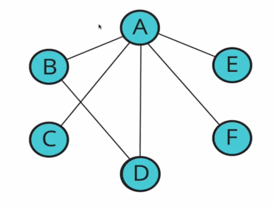
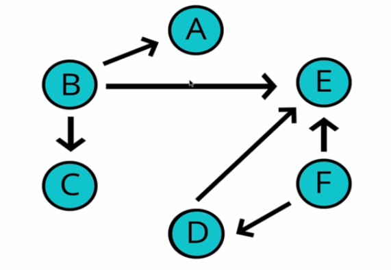
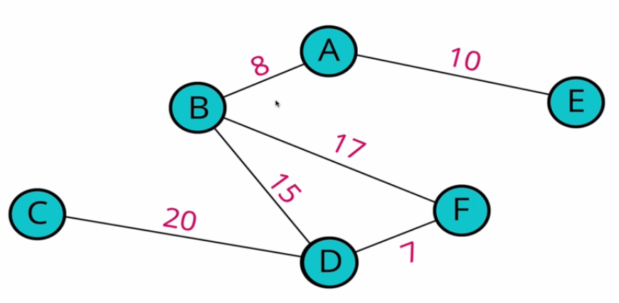
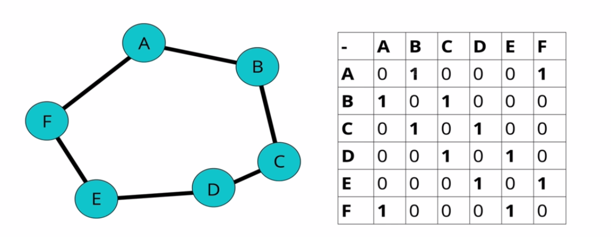
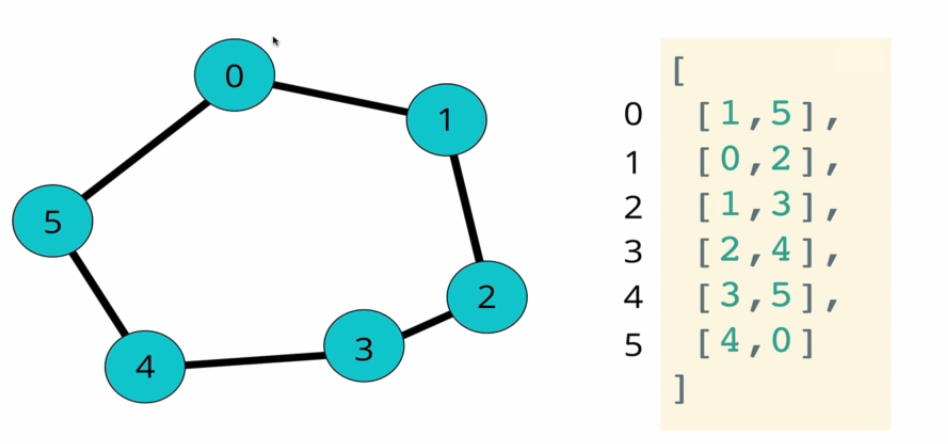
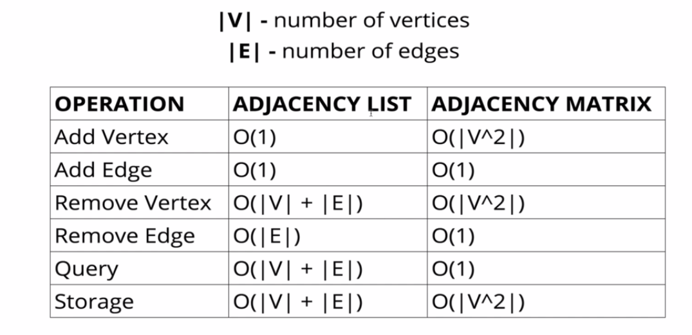

# Graphs
It is a collection of nodes and an interconnection between those nodes.  
Below are examples of graphs (Nodes + Connections)



## Uses of graphs
- Social networks
- Location/mapping
- Routing algorithms
- Visual hierarchy
- File system optimizations
- Recommendation engines

## Essential graph terminologies
- **Vertex**: A node
- **Edge**: Connection between nodes.

## Types of Graphs
### Directed vs Undirected graphs
#### Undirected graphs
- There is no direction to the edges, they are two ways connections, A-B is a connection and so is B-A.


#### Directed Graphs
- Often represented with arrows which indicates the direction of an edge.


### Weighted vs Unweighted Graphs
#### Weighted graphs
- Graphs with values associated with edges.
- Maps are perfect examples of this.


## Representation of a graph
We need a way of storing the nodes and the connections.  
There are two common ways of doing this:  
- The adjacency matrix
- The adjacency list

### adjacency matrix


An adjacency matrix is a square matrix used to represent a finite graph. The elements of the matrix indicate whether the pairs of vertices (nodes) are adjacent in the graph or not.  
In code, this would be using some deeply nested lists/arrays.

### Adjacency list
.

We use arrays/lists to store the edges or even hash tables.

### Big O of adjacency list vs adjacency matrix


We will be using an adjacency list.

## Implementation using an adjacency list
### The graph class
```python
from typing import Dict
class Graph:
    """Represents an undirected unweighted graph"""
    def __init__(self):
        self.adjacency_list: Dict = {}
```

### Adding a vertex
1. Write a method called add_vertex which accepts the value of the vertex.
1. If the value already exists in our adjacency list, ignore adding it. (most programming languages including python, should be able to handle this for you out of the box).
1. It should add a key to the adjacency list with the name of hte vertex and set the value to be an empty array.

```python
    def add_vertex(self, vertex_name: any):
        self.adjacency_list[vertex_name] = []
```

### Adding an edge
This is what will create the relationships between our vertices.

1. The function should accept two vertices, we can call them vertex1 and vertex2.
1. The function should find in the adjacency list the of key of vertex1 and push vertex2 to the array.
1. The function should find in the adjacency list the key of vertex2 and push vertex1 to the array.
```python
    def add_edge(self, vertex1: any, vertex2: any):
        """Creates a relationship between two vertex"""
        self.adjacency_list[vertex1].append(vertex2)
        self.adjacency_list[vertex2].append(vertex1)
```

### Removing an edge
1. This function accepts the names of two vertices, we'll call them vertex1 and vertex2.
1. The function should reassign the key of vertex2 to be an array that does not contain vertex1.
1. The function should reassign the key of vertex1 to be an array that does not contain vertex2.
```python
    def remove_edge(self, vertex1: any, vertex2: any):
        """Removes a vertex from the graph"""
        self.adjacency_list[vertex1].remove(vertex2)
        self.adjacency_list[vertex2].remove(vertex1)
```

### Removing a vertex
1. The function should accept a vertex to remove.
1. The function should loop as long as there are any other vertices in the adjacency list.
1. Inside the loop, call our remove_edge function with the vertex we are removing and any values in the adjacency list for that vertex.
1. Delete the key in the adjacency list for that vertex
```python
    def remove_vertex(self, vertex_name: any):
        """Removes a vertex from the adjacency list"""
        for key in self.adjacency_list.keys():
            if key == vertex_name:
                continue
            current_list:List = self.adjacency_list[key]
            # check if the current list contains the element
            # if so, delete it in relation with the key
            for element in current_list:
                if element == vertex_name:
                    self.remove_edge(key, element)
        self.adjacency_list.pop(vertex_name)
```
