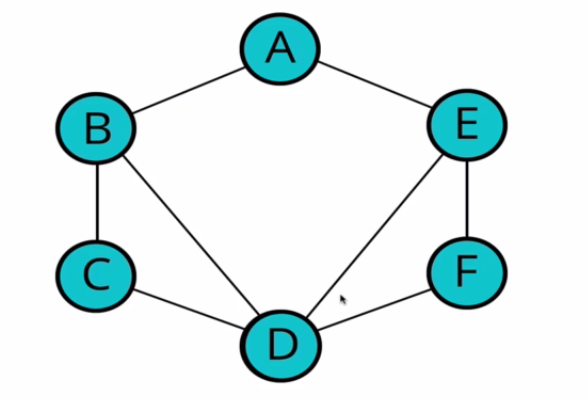

# Graphs traversal
Visiting/updating/checking each vertex in a graph.

## Depth first
Here, we explore as far as possible down one branch before "backtracking".


We will start from A, then go to B, then go to D then E then F.

The order doesn't really matter.  
It is really important to remember where you've been.

### Depth first recursive
1. Write a function that accepts a starting node
1. create a list to store the end result to be returned at the very end.
1. Create an object to store the visited vertices.
1. Create a helper function which accepts a vertex.
    1. The helper function should return early if the vertex is empty.
    1. The helper function should place the vertex it accepts into the visited object and push that vertex into the result array.
    1. Loop over all the values in the adjacencyList for that vertex.
    1. If any of those values have not been visited, recursively invoke the helper function with that vertex.
1. Invoke the helper function with the starting vertex.
1. Return the result array.
```python
def dfs_recursive(self, starting_node):
        """Performs depth first recursive traversal on a graph"""
        result: List[any] = []
        visited_nodes:Dict = {}
        
        def traverse_helper(vertex):
            if not vertex:
                return
            visited_nodes[vertex] = True
            result.append(vertex)
            for child_vertex in self.adjacency_list[vertex]:
                if not visited_nodes.get(child_vertex):
                    traverse_helper(child_vertex)
        traverse_helper(starting_node)
        return result
```

### Depth first iterative
1. The function should accept a starting node.
1. Create a stack to help us keep track of vertices (we can use an array).
1. Create a list to store the end result to be returned at the very end.
1. Create an object to store the visited vertices.
1. Add the starting vertex to the stack and mark it visited.
1. while the stack has something in it:
    1. Pop the next vertex from the stack.
    1. If the vertex hasn't been visited yet.
        1. Mark it as visited.
        1. Add it to the result list.
        1. Push all of its neighbors into the stack
1. Return the result array.
```python
def dfs_iterative(self, starting_node):
        """Performs depth first iterative traversal on a graph"""
        vertices: List[any] = []
        result: List[any] = []
        visited_vertices: Dict = {}

        vertices.append(starting_node)
        visited_vertices[starting_node] = True

        while len(vertices) > 0:
            current_vertex = vertices.pop(len(vertices)-1)
            result.append(current_vertex)
            for neighbor in self.adjacency_list[current_vertex]:
                if not visited_vertices.get(neighbor):
                    vertices.append(neighbor)
                    visited_vertices[neighbor] = True
        return result
```

## Breadth First
Visit neighbors at current depth first.
1. write a function that accepts a starting vertex.
1. Create a queue and place the starting vertex in it.
1. Create an array to store the nodes you've visited.
1. Create an object to store the nodes visited.
1. Mark the starting vertex as visited.
1. Loop as long as there is anything in the queue.
1. Remove the first vertex from the queue and push it to the array that stores the nodes visited.
1. Loop over each vertex in the adjacency list for the vertex you are visiting.
1. If it is not inside the object that stores the nodes visited, mark it as visited and enqueue the vertex.
1. Once done, return the array that stores the nodes visited.
```python
def bfs(self, starting_node):
        """Performs a breadth first traversal on the graph"""
        queue: List[any] = [starting_node]
        result: List[any] = []
        visited_nodes: Dict = {}
        visited_nodes[starting_node] = True
        
        while len(queue) > 0:
            current_vertex = queue.pop(0)
            result.append(current_vertex)
            for neighbor in self.adjacency_list[current_vertex]:
                if not visited_nodes.get(neighbor):
                    visited_nodes[neighbor] = True
                    queue.append(neighbor)
        return result
```