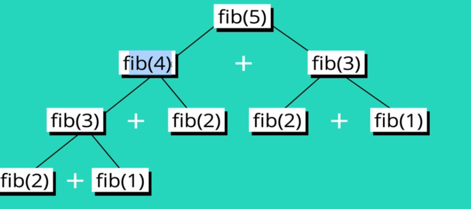
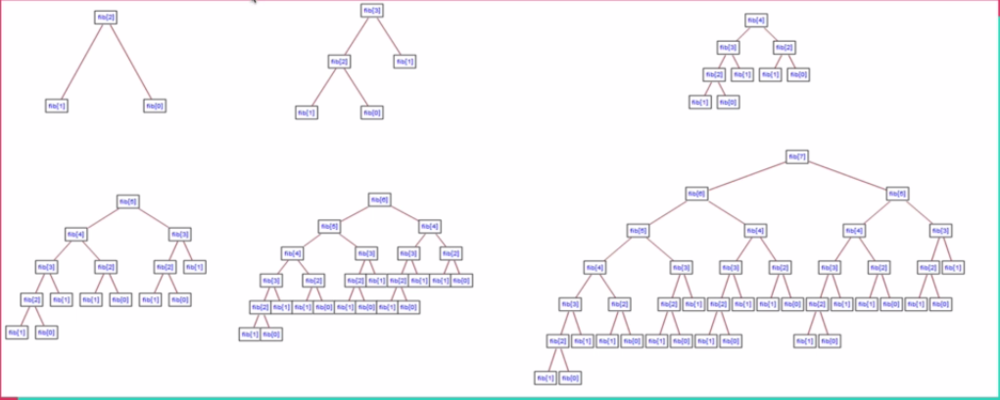

# Dynamic Programming
A method for solving a complex problem by breaking it down into a collection of simpler sub-problems, solving each of those sub-problems once, and storing their solution.

## It works with...
- Optimal substructure
- Overlapping sub-problems.

## Overlapping sub-problems
A problem is sadi to have overlapping sub-problems if it can be broken down into sub-problems which are reused several times.

Example - a fibonacci sequence - Every number is equal to the sum of the two previous numbers that come before it. -> ```1 1 2 3 5 8 13```



To get the fifth number in the sequence, we add together the fourth and the third, to find the fourth, we need to add the third and the second, e.t.c.  
As you can see, we are finding the fibonacci of 3 twice and this can go even deeper when we are finding a bigger fibonacci number. This is what we call overlapping sub-problems.

## Optimal substructure
A problem is said to have optimal substructure if an optimal solution can be constructed from optimal solutions of its sub-problems.

## Solving the fibonacci sequence without dynamic programming.
fib(n) = fib(n-1) + fib(n-2)
fib(2) = 1
fib(1) = 1

```python
def fib(n):
    """Finds the nth element in a fibonacci sequence"""
    if n <= 2:
        return 1
    return fib(n-1) + fib(n-2)
```

### Big O of the solution


The number of recursive calls grows very quickly with increase in input to our function.

O(2^n)

The real problem right now is that we are repeating things over and over, to find the fibonacci of 3, we are finding the fibonacci of 2 two times for example. (```Overlapping sub-problems```)

What if we could remember this values? This is what dynamic programming is.

Using past knowledge to make solving future problems easier.

## Memoization
- Storing the results of expensive function calls and returning the cached results when the same input occurs again.

```python
def fib(n, memo={}):
    # check if the memo dictionary has key n defined
    if n in memo:
        return memo[n]
    if n <= 2:
        return 1
    result = fib(n-1, memo) + fib(n-2, memo)
    memo[n] = result
    return result
```

In the code above, we are storing the results of smaller problems, every time we come across a new problem, we check to see whether we have solved it, if we have, we just use the result and we don't have to do any processing, otherwise, we just do the calculation.

### Big O after using memoization
O(N)

## Tabulation
Storing the result of a previous result in a "table" (Usually an array).  
Usually done using iteration.